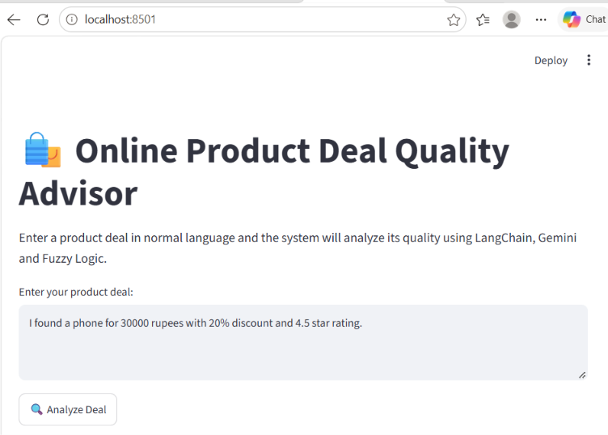
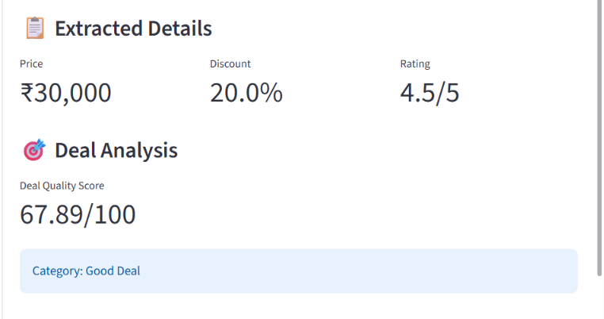

# 🛍️ Online Product Deal Quality Advisor

## Project Title

**Online Product Deal Quality Advisor**

## Short Description

The **Online Product Deal Quality Advisor** is an AI-based web application that analyzes the quality of an online product deal.

The user enters a product deal in normal language, such as:

> I found a phone for 30000 rupees with 20% discount and 4.5 star rating.

The application uses **Google Gemini and LangChain** to extract the price, discount percentage, and product rating from the user's sentence. These values are then evaluated using **Fuzzy Logic** to generate a Deal Quality Score between 0 and 100 and classify the deal as Poor, Fair, Good, or Excellent.

## Main Features
Accepts online product deal information in natural language.
Uses Google Gemini to extract price, discount, and product rating.
Uses Fuzzy Logic to evaluate the quality of the deal.
Generates a Deal Quality Score out of 100.
Classifies the deal as Poor, Fair, Good, or Excellent.
Provides an easy-to-use Streamlit web interface.
## Technologies / Tech Stack
Python
Streamlit
Google Gemini API
LangChain
Fuzzy Logic
Scikit-Fuzzy
NumPy
SciPy
NetworkX
## Installation and Setup
Clone or download the project from GitHub.
Open the project folder in VS Code.
Install the required Python libraries:
pip install -r requirements.txt
Create a .streamlit folder in the project directory.
Inside the .streamlit folder, create a file named secrets.toml.
Add the following placeholder:
GOOGLE_API_KEY = "YOUR_GOOGLE_GEMINI_API_KEY"
Replace the placeholder with your own API key locally.

Never upload the actual API key to GitHub.

## How to Run and Use the Project

Run the following command in the project folder:

streamlit run app.py

The application will open in the browser.

## How to Use
Enter an online product deal in the text box.
Click the Analyze Deal button.
The Gemini model extracts the price, discount, and rating.
The Fuzzy Logic system evaluates the deal.
The application displays the Deal Quality Score and category.
## Environment Variable / Secret

The project uses the following secret:

GOOGLE_API_KEY

Placeholder:

YOUR_GOOGLE_GEMINI_API_KEY

The actual API key must be stored only in the local .streamlit/secrets.toml file and must not be uploaded to GitHub.

## Screenshots

## Live Deployment Link

Live Project: [live deploment link](https://online-appuct-deal-quality-advisor-cy6vhlprhcctinfbzdc9p4.streamlit.app/)

_______________

## Student Details

Student Name: Gayatri Kumar
Roll Number: 19003